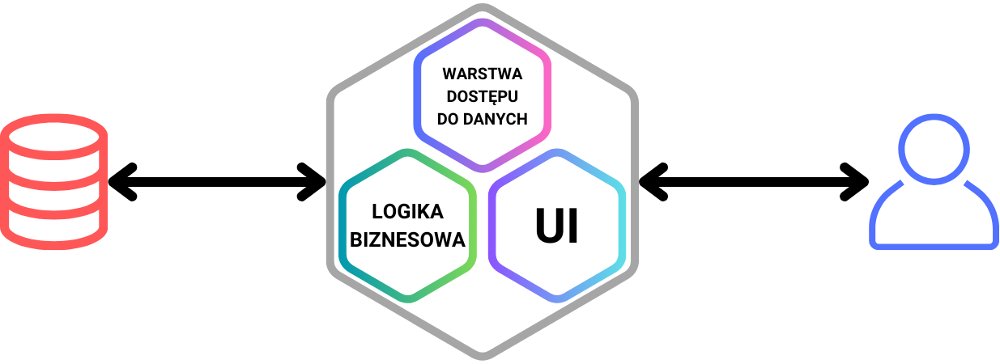
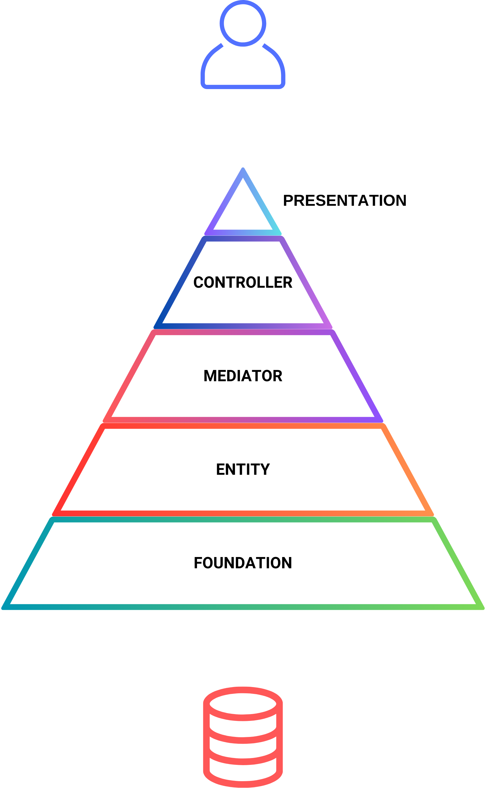
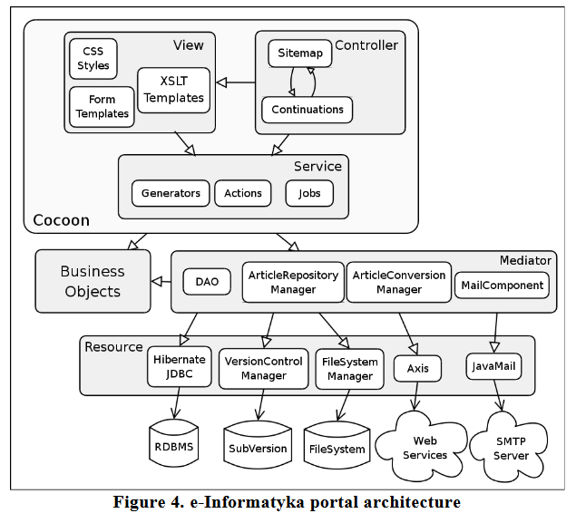

***Konieczne zdjęcie monolitu:***


[Link do prezentacji](https://docs.google.com/presentation/d/1yUMl0FLM4zLXJd3fJeIZaTlF35VI6FxmcOAWiTkUG_c/edit?usp=sharing)

# Zawartość

1. Po co nam planowanie pracy i wzorce/architektury/etc. projektowe/robocze?
2. Czym jest architektura monolityczna?
	- Dobry monolit? A co to?
	- Wady i zalety tego rozwiązania
3. Wybrane architektury monolityczne (*diagramy, charakterystyka, jak działają itd.*):
	- MVC
	- PCMEF
	- XWA
4. Monolit a mikroserwisy (*w skrócie, bo będzie osobna prezka o mikroserwisach*)
5. Czy monolit jest przyszłością?

~~Nauczycie się tu więcej o wzorcach niż na PO w zeszłym semie hehe~~
___

# 1. Po co planować pracę

- po to, żeby nie musieć łatać niepotrzebnych (= łatwych do przewidzenia) dziur


- można nawet dobrze zaplanować projekt robiący złe rzeczy - [tak jak ten projekt](https://github.com/LeviBorodenko/lancer) przerabiający ładny kod na obrzydliwy, lecz dalej funkcjonujący:

Przed:
```python
# Function that finds the sum of a list of numbers
def get_sum(nums: List[int]) -> int:
	
	sum = 0
	
	# Find the sum
	for num in nums:
		sum += num
	
	# Return the sum
	return sum

if __name__ == '__main__':
	sum = get_sum([1, 3])
	print(f"Sum of 1 and 3 is {sum}")
```

Po:
```python
# Hey baby, givin` it your all when you're dancing on me
def oink_oink_oink_llllll (ribbit_aaaaa :List [int ])->int :
	
	# Setting value of sum
	sum =0
	
	# Bada bing, bada boom
	for num in ribbit_aaaaa :
		sum +=num
		
		# there's nothing like Miami's heat
	return sum

if __name__ == '__main__':
	sum =oink_oink_oink_llllll ([1 ,3 ])
	print (f"Sum of 1 and 3 is {sum}")
```

Co nam w tym pomoże? ***Wzorce projektowe***, czyli schematy/szablony/podejścia do tworzenia aplikacji. Jednym z takich podejść jest **architektura monolityczna**.

___

# 2. Czym jest architektura monolityczna?

Aplikacja stworzona na bazie architektury monolitycznej (aplikacja monolityczna) to aplikacja w której różne komponenty (autoryzacja, uwierzytelnianie, logika biznesowa, moduł notyfikacyjny, itd.) są połączone w jeden program działający na jednej platformie[^1].


>[!tip] Większość programów i aplikacji, które pisaliśmy do tej pory bazuje na architekturze monolitycznej

**Co charakteryzuje architekturę monolityczną?**
- Jedna baza kodu
- Ścisła integracja komponentów aplikacji
- Wspólna pula pamięci
> 	Pozwala na szybką i efektywną komunikację między komponentami, ale zarządzanie pamięcią współdzieloną może być trudne
- Zcentralizowana baza danych
- Struktura warstwowa
>	 Pomiędzy użytkownikiem, a bazą danych stoją ustrukturyzowane i połączone ze sobą warstwy prezentacji, logiki biznesowej i dostępu do danych
- Ograniczona skalowalność

# 3. Jak stworzyć dobry monolit? Wady i zalety

Aby monolit był uznany za ***dobry***, musi być przede wszystkim *przemyślany* i *odpowiednio wdrożony*[^2]\:

#### Zasady projektowania
- Modularność
> 	Mimo jednej bazy kodu i jednej maszyny, poszczególne komponenty aplikacji powinny być projektowane tak, żeby umożliwić ponowne wykorzystywanie modułów w różnych fragmentach aplikacji, ułatwić konserwację i zmniejszyć skomplikowanie kodu.
- Rozdział obowiązków
>	Różne komponenty aplikacji powinny zajmować się oddzielnymi zadaniami.
- Skalowalność
>	Skalowanie monolitu hardware'owo jest trudniejsze niż w architekturze mikro-serwisów. Z tego powodu należy skupić się na optymalizacji kodu, cache'owaniu i zrównoleglania procesów.
- Enkapsulacja
>	Czyli tworzenie dobrze zdefiniowanych interfejsów między komponentami i dla całej aplikacji, które nie ujawniają więcej wewnętrznych systemów niż jest to potrzebne.
- Konsekwencja
>	Skoro pracujemy na jednym kodzie, to powinniśmy ujednolicić go najbardziej jak to tylko możliwe.
- Prostota nad złożonością
>	Jak w większości systemów, im prościej - tym lepiej. Nie warto kombinować no chyba, że jest to absolutnie potrzebne.
- Testowalność

## Zalety monolitu
- Jednolitość
>	Architektura tego rodzaju zapewnia, że wszystkie składowe końcowej aplikacji będą ze sobą *na pewno* dobrze zgrane.
- Uproszczenie procesów tworzenia, debugowania, testowania i wdrażania (z zasady, dalej może stać się to wadą)[^3]
>	Wszystko mamy tak naprawdę w jednym miejscu, nie jesteśmy ograniczani przez zewnętrzne czynniki w jakiejkolwiek kwestii, wszystko zależy od nas: jaki jest plan pracy nad projektem i jak jest on wykonywany.
- Co idzie za powyższym, *performance* aplikacji jest lepszy w takiej strukturze. Dla mniejszych pul zapytań monolit jest o 30% wydajniejszy w obsłudze zapytań HTTP GET od mikroserwisów, oraz jego czas odpowiedzi jest o 66% szybszy.[^1]
>	Jak wyżej, dzięki temu, że wszystko jest w jednym miejscu nie musimy implementować nadmiarowych API do zapewnienia komunikacji między segmentami, wszystko może być obsługiwane przez jednego gagatka.
- Niższe koszty, szybsza praca, widoczny progres. Systemy oparte na architekturze monolitycznej są o 34% tańsze od porównywalnych systemów mikroserwisowych.[^4]
>	Powyższe zalety brzmią tak dobrze, że aż tworzą kolejną zaletę - bardzo szybko można zauważyć efekty pracy, rozwój i postawienie projektu we wczesny etap jest bardzo wygodne i szybkie, co daje dużo endorfin.

## Wady *nawet dobrego* monolitu
- Długie cykle wdrażania
>	Zwykle zakłada to skompilowanie i wdrożenie całości kodu co potrafi  być *naprawdę* długie.
- Ograniczona skalowalność
>	Możemy skalować pionowo (ulepszać hardware jednej maszyny), ale to bardzo szybko staje się trudne i drogie. Możemy też skalować poziomo (dodawać więcej maszyn), ale to wymaga load-balancingu i kopiowania całości systemu do nowej maszyny. Tę samą analogię można wysunąć względem kodu.
- Ograniczona elastyczność
>	Wprowadzenie zmian w jednej części kodu może być związane z koniecznością wprowadzenia kolejnych zmian ("*łatek*") w innej jego części. Dodatkowo, między innymi przez w.w. długie cykle wdrażania, czasami trudniej jest wprowadzać jakiekolwiek zmiany w sensownym czasie, w szczególności mowa tu o hardwarze.
- Im dalej w las, tym ciemniej[^3]
>	Na samym początku rozwoju projektu monolit jest najpopularniejszym wyjściem, a do małych projektów zapewnia najlepsze efekty. Gorzej, gdy projekt staje się bardziej złożony, wymagający - ogólnie większy: makaron zamiast kodu, koszty czy problemy ze zmianą nawet linijki kodu to dopiero początek rozważań na temat zmiany architektury.

___

# 4. Wybrane architektury monolityczne

## MVC[^5]

***Model-View-Controller \[MVC]*** to wzorzec projektowy, którego główną zasadą działania jest podział aplikacji na trzy podstawowe segmenty:
- *model*, czyli warstwę obsługi wszelkich połączeń i działań na danych, ogólnej logiki aplikacji - w skrócie backend
- *view*, czyli tak naprawdę UI, które "komunikuje się" bezpośrednio z użytkownikiem - obsługuje wyświetlanie wszystkiego co potrzebne, zbieranie danych i wywoływanie poleceń/żądań/itp. np. po kliknięciu odpowiedniego przycisku przez użytkownika;
- *controller*, czyli warstwę "pośrednią", między *model* a *controller* - odpowiada za ich synchronizację, odpowiednią komunikację i ogólną pracę aplikacji; można więc go nazwać de facto mózgiem/zarządcą całego działania programu.


#### Przykład

***Edytor tekstu*** składający się z modułów:
- **UI/Frontend**, w którego skład wchodzą klasy typu *AppWindow*, *ToolBar*, *MainTextField* etc.; ma on za zadanie wyświetlać sformatowany tekst, a także interfejs z paskami narzędzi i dostępnymi opcjami - segment *view*
- **Backend**, w którego skład wchodzą klasy typu *FileManager*, *UpdateManager*, *MetaData*, *VersionControl* etc.; ten moduł odpowiada za zapis/czytanie plików na dysku, sprawdzanie i  wykonywanie aktualizacji, interpretowanie/edycję/zapis metadanych pliku (np. daty utworzenia, autora) - segment *model*
- **Delivery Boy/Main Manager**, w którego skład wchodzi np. *RunWindow*, *PrepareApp*, *NewFile* itd.; bardziej "wysokopoziomowy" moduł, który de facto obsługuje żądania od użytkownika i zarządza pracą całej aplikacji: włącza dane okienka (mówiąc przy tym UI co wyświetlić, a Backendowi jakich informacji do tego potrzebuje), przygotowuje aplikację do działania itd. - segment *controller*


## PCMEF

Architektura typu ***Presentation-Controller-Mediator-Entity-Foundations \[PCMEF]*** ma pewne cechy wspólne ze wspomnianym MVC, jest jednak bardziej hierarchiczna i ma nieco inną strukturę.[^6]
Posiada to parę istotnych zasad, o których nie będziemy teraz mówić, ale opisują one (tak jak np. w modelu OSI) warunki komunikacji między warstwami/segmentami modelu.[^9]



1. *Presentation Layer*: segment aplikacji odpowiedzialny za obsługę interfejsu graficznego/użytkownika, czyli de facto znowu frontend;
2. *Controller Layer*: segment odpowiedzialny za interpretację i obsługę żądań/działań, które od użytkownika odbierze *Presentation Layer* - będzie to "wysokopoziomowe" zarządzanie zadaniami, np. zmapowanie kliknięć przycisków na wywołania funkcji/metod;
3. *Mediator Layer*: **(DOMAIN)** segment wręcz centralny, odpowiedzialny za wykonywanie już konkretnych czynności na obiektach czy też po prostu realizacji żądań użytkownika, mówi niższym warstwom co mają "wykonać" na jakich obiektach (na przykładzie logowania użytkownika: "sprawdź czy taki user istnieje", "sprawdź czy jego dane się zgadzają", "autoryzuj logowanie", "potwierdź sukces logowania" itp.);
4. *Entity Layer*: **(DOMAIN)** segment odpowiedzialny za "przechowywanie" i obsługę obiektów "biznesowych?" (***trzeba to lepiej napisać***), czyli bardziej abstrakcyjną/logiczną reprezentację tego, co zapisujemy w plikach *.json* albo w bazie danych (takie jakby obiekty reprezentujące nasze dane, coś jak nasz Kanban Board czy Card);
5. *Foundation Layer*: segment obsługujący stricte zapis i czytanie danych, obsługę ich ewentualnej transmisji itp.; najbardziej niskopoziomowa obsługa aplikacji;

#### Przykład

***Aplikacja bankowa***, która obsługuje konta użytkowników trzymane w pewnego rodzaju bazie danych (dla uproszczenia typu SQL) - jej kolejne warstwy w modelu **PCMEF** to:
1. **UI**, czyli interfejs otrzymujący polecenia/żądania od użytkownika i wyświetlający mu dane/okienka itp. (*Presentation*)
2. **RequestManager**, czyli obsługa logiki interfejsu, która wymaga czegoś więcej niż fajnych animacji, np. wczytania określonych danych do logowania. Przede wszystkim interpretuje, która funkcja ma obsłużyć kliknięcie "zaloguj", zbiera ewentualne dane np. z pól tekstowych (login, hasło), po czym przekazuje je niżej - dosłownie strzałka w relacji typu *frontend action $\rightarrow$ backend action*.
3. **Mediator/MainManager** będzie w takiej sytuacji obsługiwał połączenia między żądaniami z warstwy wyżej (czyli zaloguj usera o takich danych) i egzekwował polecenia na obiektach/danych z warstwy niżej (z ewentualnym wykorzystaniem ich funkcjonalności); będzie to główna część backendu, najbardziej "wysokopoziomowa".
4. **DataManager** będzie przechowywać wczytane dane np. w formie obiektów i obsługiwał je za pomocą danych metod - będzie to reprezentacja np. danych użytkowników w formie obiektu w programie, która może obsługiwać żądania typu "sprawdź czy ktoś taki istnieje", "sprawdź czy dane hasło odpowiada loginowi" itd.
5. **FileManager/DatabaseConnection**, czyli warstwa najniższa, która obsłuży np. czytanie danych z bazy czy zapis do pliku. Przekaże warstwie wyżej odpowiednie loginy, informacje nt. użytkownika lub zarejestruje nowego w bazie.

## XWA

![Schemat działania XWA z dokumentu autorów [^7]](./media/XWA_scientific.png)

>[!info]- Handmade schemat
>


***eXtensible Web Architecture \[XWA]*** to wzorzec zaproponowany jako połączenie największych zalet zarówno MVC, jak i PCMEF, który zaplanowano jako czteropoziomową strukturę warstwową (a więc hierarchiczną), składającą się z sześciu segmentów[^7]\:

- *Presentation Layer*: jest to niejako połączenie partii *View* oraz *Controller* z modelu **MVC**; segmenty składające się na tę warstwę mają nawet takie same nazwy:
	- segment *View* jest dokładnie tym samym co w **MVC** - ma on "odpowiadać" na żądania użytkownika przygotowanymi, sformatowanymi danymi czy efektami jego działań, które dostanie od segmentu *Controller*. De facto zadaniem *View* jest obsługa poprawnego wyświetlania - czysty frontend. Dodatkowo autorzy *w tym miejscu* sugerują XML? XD
	- segment *Controller*, podobnie jak w **MVC** kieruje logiką do obsługi żądań użytkownika i zarządza (w tej kwestii) pracą niższych warstw. Gotowe wyniki pracy aplikacji kieruje do segmentu *View* i "mówi mu" co i jak ma wyświetlić.

Poniższe warstwy razem składają się na cały segment ***Model**** z **MVC**:
- *Control Layer* - segment *Service*: jest to trochę bardziej niskopoziomowy *Controller*, obsługuje on bowiem logiką całego wnętrza aplikacji jako takiej, jest "mózgiem" backendu. 
- *Domain Layer* składa się z segmentów *Business Objects* oraz *Mediator*, które są wręcz wyciągnięte z **PCMEF** - odpowiadają za:
	- "obiekty biznesowe", które reprezentują obiekty np. z baz danych czy plików, budują aplikację i wprowadzają ich mechaniki (*Business Objects*).
	- pośredniczenie między *Business Objects* a *Services*, poprzez wykonywanie działań na danych, np. czytanie ich (wzorce *Data Access Object*).
- *Foundation Layer* - segment *Resource*: najbardziej niskopoziomowy dostęp do danych w plikach lub w bazie danych, czyli ich czytanie, pisanie etc. "fizyczne".

#### Przykład

Implementacja **portalu autorów XWA**, który został przedstawiony w dokumencie proponującym XWA:



# 5. Monolit i mikroserwisy

***Mikroserwisy*** to wiele składowych jednej, większej aplikacji, które są od siebie niezależne, często pisane w różnych językach, dostarczane przez różnych deweloperów itd.

### A w czym to lepsze od monolitu?

***No, może nie zawsze jest to lepsze, ale daje sporo innych możliwości*** - aplikacja jest rozłożona na wiele, niezależnych od siebie składowych[^8]\:
- pracują nad nimi różne zespoły, również z reguły niezależne = liniowa praca, inne skalowanie problemów (np. debugowania czy czasu pracy jako takiej)
- różne składowe mają dostarczać określone funkcjonalności i nie przejmować się innymi = podział i decentralizacja aplikacji
- powinny jedynie dostarczać narzędzia, które pomogą je połączyć (wraz z innymi) w końcowy program = konieczność budowania dodatkowych narzędzi do koordynacji pracy

### Co więc wybrać?

Z reguły jest prosta zależność (zależy to naturalnie od tony niuansów, ale tak generalnie): ***większe aplikacje***, oferujące więcej różnorodnej funkcjonalności, lepiej wyjdą na ***strukturze mikroserwisowej***, a ***mniejsze*** lub bardziej skoncentrowane/jednokierunkowe projekty będą lepiej działać jako ***monolit***.

___

# 6. Czy monolit jest przyszłością? Czyli podsumowanie


***No tak, ale nie do końca*** - aplikacje monolityczne sprawdzają się w małych projektach, które np.:
- mają zaoferować niewielką lub jednokierunkową funkcjonalność;
- chcą cechować się prostotą struktury, by np. wykazać się w innej dziedzinie jej stworzenia, jak szybkość algorytmów itp. (a więc portfolio lub nauka poszczególnych zagadnień)

Jeśli bawimy się w większe aplikacje, które mają dostarczać *wiele* np. Netflix, to mikroserwisy są koniecznością - łatwiej to wszystko zorganizować.

___

# Koniec


[^1]: Gos, Konrad, i Wojciech Zabierowski. „The Comparison of Microservice and Monolithic Architecture”. W _2020 IEEE XVIth International Conference on the Perspective Technologies and Methods in MEMS Design (MEMSTECH)_, 150–53, 2020. [https://doi.org/10.1109/MEMSTECH49584.2020.9109514](https://doi.org/10.1109/MEMSTECH49584.2020.9109514).(MEMSTECH)_, 150–53, 2020. [https://doi.org/10.1109/MEMSTECH49584.2020.9109514](https://doi.org/10.1109/MEMSTECH49584.2020.9109514).

[^2]: GeeksforGeeks. „Monolithic Architecture - System Design”, 5 kwiecień 2024. [https://www.geeksforgeeks.org/monolithic-architecture-system-design/](https://www.geeksforgeeks.org/monolithic-architecture-system-design/).

[^3]: Monolithic Architecture. Advantages and Disadvantages, Oleksii Dushenin, Medium (Oct 22, 2021) https://datamify.medium.com/monolithic-architecture-advantages-and-disadvantages-e71a603eec89

[^4]: Blinowski, Grzegorz, Anna Ojdowska, i Adam Przybyłek. „Monolithic vs. Microservice Architecture: A Performance and Scalability Evaluation”. _IEEE Access_ 10 (2022): 20357–74. [https://doi.org/10.1109/ACCESS.2022.3152803](https://doi.org/10.1109/ACCESS.2022.3152803).

[^5]: model-view-controller (MVC), by Robert Sehldon (TechTarget | WhatIs) https://www.techtarget.com/whatis/definition/model-view-controller-MVC

[^6]: The PCMEF Architecture for Web Systems, Aswin Vijayakumar, Medium (Jul 29, 2023) https://medium.datadriveninvestor.com/the-pcmef-architecture-for-web-systems-b1f7b626b71a

[^7]: Architectural Design of Modern Web Applications, Lech Madeyski, Michał Stochmiałek (2005) https://madeyski.e-informatyka.pl/download/23.pdf

[^8]: What's the difference between monolithic and microservices architecture? | AWS https://aws.amazon.com/compare/the-difference-between-monolithic-and-microservices-architecture/

[^9]: Zasady działania warstw PCMEF: https://www.e-informatyka.pl/index.php/pimio/inzynieria-wymagan/znaczenie-architektonicznego-projektu-systemu-w-inzynierii-oprogramowania/#3.ZasadyiwzorcePCMEF